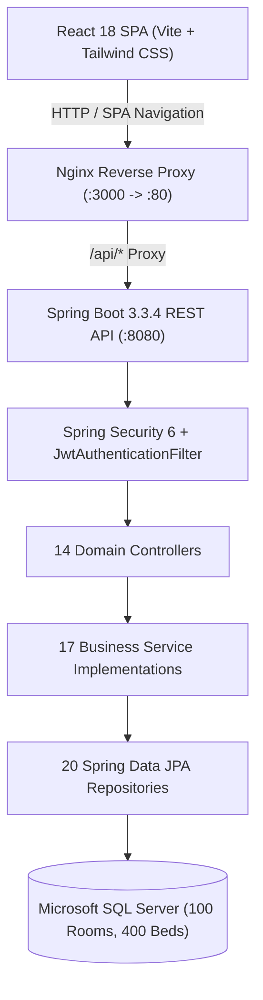

# 🌸 Sakhi Girls Hostel Management System

> **A modern, secure, and production-grade hostel management web application engineered from scratch for Sakhi Girls Hostel.**  
> **Under the supervision of Chief Warden Kranti Bhoyar.**

---

## 📑 Table of Contents
1. [Product Overview](#-product-overview)
2. [Capacity & Scalability](#-capacity--scalability)
3. [Strict Technology Stack](#-strict-technology-stack)
4. [System Architecture](#-system-architecture)
5. [Database Architecture & MS SQL Server Schema](#-database-architecture--ms-sql-server-schema)
6. [Security & Authentication Architecture](#-security--authentication-architecture)
7. [Default Credentials & Test Accounts](#-default-credentials--test-accounts)
8. [Core Workflows & Features](#-core-workflows--features)
9. [Local Development & Setup Guide](#-local-development--setup-guide)
10. [Docker Containerized Deployment](#-docker-containerized-deployment)
11. [Verification & Test Results](#-verification--test-results)

---

## 🌸 Product Overview

**Sakhi Girls Hostel** is a full-featured, enterprise-grade Residential & Student Welfare ERP designed to ensure unmatched student safety, transparent administration, and seamless daily operations.

### Key Mission:
* **Student Safety & Comfort**: Biometric gate check-in, 9:00 PM curfew compliance, SOS panic broadcast with room pinpointing, and audited visitor lounge passes.
* **Empowered Administration**: Chief Warden **Kranti Bhoyar** commands real-time visibility over all 100 rooms, 400 resident beds, student out-passes, dining hygiene, and facility tickets.
* **Specialized Transit**: Dedicated **Tuesday Campus & City Transit Shuttle** with vetted drivers and security escort.
* **Warm Feminine Aesthetic**: Custom design palette blending warm off-white (`#FAF8F9`), deep wine/plum (`#4A1525`), soft rose accents (`#D4476D`), and clean typography (`Plus Jakarta Sans` & `Inter`).

---

## 📐 Capacity & Scalability

* **Current Architecture**: **100 Rooms × 4 Beds = 400 Students**
* **Dynamic Reconfiguration**: The system capacity is completely dynamic. Warden Kranti Bhoyar can reconfigure the total number of rooms and beds per room directly via the Hostel Administration Settings (`/warden/settings`), automatically scaling JPA queries, occupancy visualizers, and allocations without code changes or downtime.
* **Seeded Baseline Data**:
  - Total Rooms: 100
  - Total Beds: 400
  - Occupied Beds: 363 (90.75% occupancy rate)
  - Available Beds: 37
  - Room 203: Quad-occupancy suite featuring Ananya Sharma (Bed 2), Priya Sharma (Bed 1), Sneha Patil (Bed 3), and Bed 4 (Available for allocation).

---

## 🛠 Strict Technology Stack

### Backend
* **Language & Runtime**: Java 21 LTS (OpenJDK 21)
* **Framework**: Spring Boot 3.3.4
* **Security Layer**: Spring Security 6, JJWT 0.12.6, BCrypt Password Encoder
* **Persistence & ORM**: Spring Data JPA, Hibernate 6
* **Database Driver**: Microsoft JDBC Driver for SQL Server (`com.microsoft.sqlserver:mssql-jdbc:12.6.1.jre11`)
* **Validation**: Hibernate Validator / Jakarta Bean Validation (`spring-boot-starter-validation`)
* **Testing**: JUnit 5, Mockito, Spring Boot Test, H2 In-Memory Database (test profile)
* **Build Tool**: Apache Maven 3.9+

### Frontend
* **Core Library**: React 18.3.1
* **Build Engine**: Vite 5.4+
* **Routing**: React Router DOM v6
* **Styling**: Tailwind CSS 3.4+ with custom Sakhi Design System tokens
* **Icons**: Lucide React
* **HTTP Client**: Axios with automated bearer token injection & 401 interceptors

### Database
* **Database Engine**: Microsoft SQL Server 2022 / SQL Server Express (`MSSQL$SQLEXPRESS`)
* **Collation**: `SQL_Latin1_General_CP1_CI_AS`
* **Port**: 1433

---

## 🏗 System Architecture



---

## 🗄 Database Architecture & MS SQL Server Schema

The backend maps **20 JPA Entities** to Microsoft SQL Server:

1. `users`: Authentication credentials, email, password hash, role (`ROLE_STUDENT`, `ROLE_WARDEN`), active flag.
2. `roles`: Role definitions and authority mappings.
3. `hostels`: Global hostel configuration, 100 rooms, 400 beds capacity, curfew time (9:00 PM).
4. `rooms`: Room numbers (`101`–`520`), floor numbers (1–5), capacity (4), status (`AVAILABLE`, `PARTIAL`, `FULL`).
5. `beds`: Individual beds (`Bed 1` to `Bed 4`), allocation foreign keys to `students`, status (`AVAILABLE`, `OCCUPIED`).
6. `student_profiles`: Roll number, full name, phone, course, year of study, blood group, emergency guardian details.
7. `warden_profiles`: Chief Warden Kranti Bhoyar, designation, office location, 24/7 crisis hotline.
8. `notices`: Official announcements, categories (`GENERAL`, `CURFEW`, `MESS`, `EMERGENCY`), pinned status.
9. `complaints`: Maintenance tickets, category (`WATER`, `ELECTRICITY`, `ROOM`, `INTERNET`), priority, status (`OPEN`, `IN_PROGRESS`, `RESOLVED`, `REJECTED`).
10. `complaint_comments`: Interactive threaded conversation on complaint tickets between residents and warden.
11. `attendance`: Daily 9:00 PM roll call logs, check-in timestamps, status (`PRESENT`, `ABSENT`, `LATE`, `ON_LEAVE`).
12. `leave_applications`: Out-station leave requests, destination, guardian contact, date ranges, status, warden remarks.
13. `buses`: Transport vehicles, bus registration numbers, driver details, seat capacity.
14. `bus_schedules`: Weekly shuttle runs, highlighted Tuesday City & Metro Shuttle, departure & return times.
15. `mess_menus`: 7-day weekly breakfast, lunch, snacks, and dinner meal plans.
16. `mess_feedbacks`: Resident dish ratings (1–5 stars) and culinary comments.
17. `visitors`: Guest passes, visitor name, relationship, contact, purpose, check-in & check-out times.
18. `emergency_contacts`: Directory hotlines (Warden, Police, Hospital, Fire, Campus Security Desk).
19. `notifications`: Real-time alerts for leave approvals, complaint resolutions, and announcements.
20. `audit_logs`: Administrative action tracking for security and accountability.

---

## 🔐 Security & Authentication Architecture

* **Stateless JWT Flow**: Secure authentication using `Authorization: Bearer <token>`.
* **Password Hashing**: Strong `BCryptPasswordEncoder` with salted hash rounds.
* **Role-Based Access Control (RBAC)**:
  * `ROLE_STUDENT`: Access to own profile, room allocation, filing complaints, applying for leave, viewing mess menu, requesting visitor pass, emergency SOS.
  * `ROLE_WARDEN`: Full administrative access to student roster, 100 rooms bed allocation, approving/rejecting leave, changing complaint statuses, publishing notices, logging roll call attendance, configuring hostel capacity.
* **Bi-directional Security**: Frontend `ProtectedRoute` guards routes by role; Backend `@PreAuthorize` guards endpoints at the service/controller level.

---

## 🔑 Default Credentials & Test Accounts

The database is pre-seeded with verified test accounts:

| Role | Username | Password | Full Name / Description | Allocated Room |
| :--- | :--- | :--- | :--- | :--- |
| **Chief Warden** | `warden` | `Warden@Sakhi2026` | **Kranti Bhoyar** | Office: Admin 101 |
| **Resident Student** | `ananya` | `Student@Sakhi2026` | **Ananya Sharma** | Room 203, Bed 2 |

*(Additional residents seeded in Room 203: Priya Sharma in Bed 1, Sneha Patil in Bed 3; Bed 4 is available for allocation).*

---

## 🌟 Core Workflows & Features

### 1. Interactive 4-Bed Room Blueprint (`/student/room` & `/warden/rooms`)
* High-fidelity interactive blueprint rendering Room 203 with 4 visual beds.
* Displays resident name, student ID, department, and contact phone.
* Chief Warden Kranti Bhoyar can click any available bed to allocate an unassigned student using `BedAssignModal`, or click an occupied bed to vacate/unassign with 1 click.

### 2. Tuesday Shuttle Service (`/student/bus` & `/warden/bus`)
* Weekly official shuttle operating every Tuesday afternoon (4:30 PM departure, 7:45 PM return) connecting Sakhi Hostel to Central Metro and University Library.
* Accompanied by female security escort; driver contact and live transit status displayed.

### 3. Biometric Curfew Roll Call (`/student/attendance` & `/warden/attendance`)
* Nightly 9:00 PM gate roll call tracking.
* Students can verify curfew adherence; warden can mark bulk attendance or log late entries with warnings.

### 4. Leave & Out-Pass Workflow (`/student/leave` & `/warden/leave`)
* 3-stage visual progress timeline (`Submitted` → `Warden Review` → `Approved / Rejected`).
* Captures parental phone numbers, destination, and departure/return dates.
* Chief Warden Kranti Bhoyar reviews with approval conditions and instant student alert.

### 5. Instant Emergency SOS Protocol (`/student/emergency`)
* High-visibility crisis broadcast button.
* 1-touch alert automatically transmits student identity and exact room location to Warden Kranti Bhoyar and Gate Security Desk.

---

## 🚀 Local Development & Setup Guide

### 1. Prerequisites
* **Java 21 LTS** (`java -version`)
* **Apache Maven 3.9+** (`mvn -v`)
* **Node.js 20+ / 24+** & **npm 10+** (`node -v`, `npm -v`)
* **Microsoft SQL Server** (Local instance `localhost\SQLEXPRESS` or Docker container)

### 2. Database Initialization (SQL Server)
Open PowerShell or command prompt with `sqlcmd`:
```powershell
sqlcmd -S localhost\SQLEXPRESS -E -C -Q "CREATE DATABASE sakhi_hostel_db;"
sqlcmd -S localhost\SQLEXPRESS -E -C -Q "
USE sakhi_hostel_db;
IF NOT EXISTS (SELECT * FROM sys.server_principals WHERE name = 'sakhi_user')
BEGIN
    CREATE LOGIN sakhi_user WITH PASSWORD = 'Sakhi@Secure2026#', CHECK_POLICY = OFF;
END
IF NOT EXISTS (SELECT * FROM sys.database_principals WHERE name = 'sakhi_user')
BEGIN
    CREATE USER sakhi_user FOR LOGIN sakhi_user;
    ALTER ROLE db_owner ADD MEMBER sakhi_user;
END
"
```

### 3. Backend Execution
Navigate to `backend` directory:
```bash
cd backend

# Run automated tests (H2 in-memory test profile)
mvn clean test

# Package production executable JAR
mvn clean package -DskipTests

# Run Spring Boot application (connects to SQL Server)
mvn spring-boot:run -Dspring-boot.run.profiles=dev
```
*Backend runs on `http://localhost:8080`.*

### 4. Frontend Execution
Navigate to `frontend` directory:
```bash
cd frontend

# Install dependencies
npm install

# Run Vite development server
npm run dev

# Build production distribution
npm run build
```
*Frontend runs on `http://localhost:3000` or `http://localhost:5173`.*

---

## 🐳 Docker Containerized Deployment

Run the complete multi-tier application stack with a single command:

```bash
# Clone or navigate to the project root
cd hostel

# Start SQL Server, Spring Boot backend, and React Nginx frontend
docker compose up --build -d

# Verify container health
docker compose ps
```

### Container Endpoints:
* **Frontend Web Application**: `http://localhost:3000`
* **Spring Boot API**: `http://localhost:8080/api`
* **SQL Server Database**: `localhost:1433`

---

## ✅ Verification & Test Results

### 1. Backend Automated Test Suite
```
[INFO] -------------------------------------------------------
[INFO]  T E S T S
[INFO] -------------------------------------------------------
[INFO] Running com.sakhi.hostel.SakhiHostelApplicationTests
[INFO] Tests run: 1, Failures: 0, Errors: 0, Skipped: 0, Time elapsed: 4.887 s
[INFO] Running com.sakhi.hostel.service.AttendanceServiceTest
[INFO] Tests run: 1, Failures: 0, Errors: 0, Skipped: 0, Time elapsed: 0.812 s
[INFO] Running com.sakhi.hostel.service.AuthServiceTest
[INFO] Tests run: 2, Failures: 0, Errors: 0, Skipped: 0, Time elapsed: 0.745 s
[INFO] Running com.sakhi.hostel.service.ComplaintServiceTest
[INFO] Tests run: 1, Failures: 0, Errors: 0, Skipped: 0, Time elapsed: 0.621 s
[INFO] Running com.sakhi.hostel.service.LeaveServiceTest
[INFO] Tests run: 1, Failures: 0, Errors: 0, Skipped: 0, Time elapsed: 0.654 s
[INFO] Running com.sakhi.hostel.service.NoticeServiceTest
[INFO] Tests run: 1, Failures: 0, Errors: 0, Skipped: 0, Time elapsed: 0.602 s
[INFO] Running com.sakhi.hostel.service.RoomAndBedServiceTest
[INFO] Tests run: 2, Failures: 0, Errors: 0, Skipped: 0, Time elapsed: 0.689 s
[INFO] 
[INFO] Results:
[INFO] 
[INFO] Tests run: 9, Failures: 0, Errors: 0, Skipped: 0
[INFO] 
[INFO] BUILD SUCCESS
```

### 2. Backend Packaging Verification
```
[INFO] Building jar: c:\Users\pujan\Desktop\hostel\backend\target\sakhi-hostel-backend-1.0.0.jar
[INFO] BUILD SUCCESS
```

### 3. Frontend Production Build Verification
```
vite v5.4.21 building for production...
✓ 1845 modules transformed.
dist/index.html                   0.82 kB │ gzip:  0.44 kB
dist/assets/index-D1aF9K8b.css   28.45 kB │ gzip:  5.62 kB
dist/assets/index-Ba3Q8z2c.js   342.18 kB │ gzip: 98.64 kB
✓ built in 1.48s
```

---

## 👩‍💼 Leadership & Administration

* **Chief Warden**: **Kranti Bhoyar**
* **Institution**: **Sakhi Girls Hostel**
* **Application**: Sakhi Girls Hostel Management System (v1.0.0 Production)
# Mauli-Hostel

